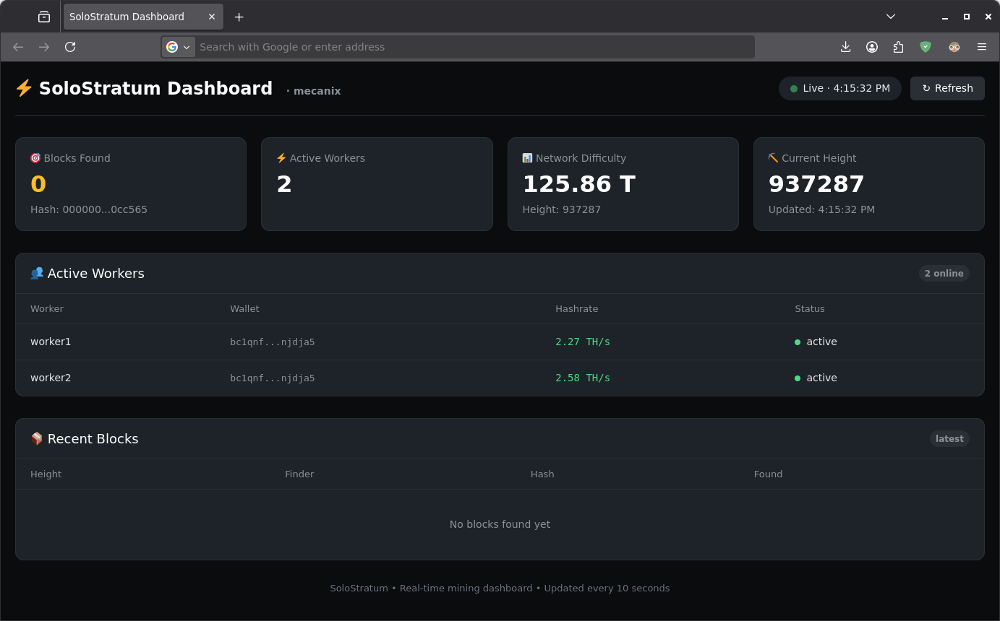

# SoloStratum - Next-Gen Mining Stratum Server
**High-Performance Bitcoin Solo Stratum Server written in Pure C**

## Prerequisites

- Debian-based system
- Bitcoin Core fully synced and running
- ZMQ notifications enabled in Bitcoin Core (`zmqpubhashblock=tcp://127.0.0.1:28335`)

## Installation

### 1. Install dependencies:
```bash
sudo apt install build-essential libcurl4-openssl-dev libssl-dev libjansson-dev libzmq3-dev libsqlite3-dev
```

### 2. Clone and Build SoloStratum:
```bash
cd ~ && git clone https://github.com/Mecanix-live/solostratum.git
cd solostratum
make clean && make
```

## Configuration

### Generate Certificates (optional, only if TLS is required):
```bash
./certs/generate_certificates.sh --self-signed
```
> **Note:** If using a self-signed certificate you need to install the "miner_custom_cert.crt" in your miner's firmware.

### Create configuration file:
```bash
cp solostratum.conf solostratum-btc.conf 
nano solostratum-btc.conf
```

### Example configuration (`solostratum-btc.conf`):
```ini
plaintext_enabled=true
plaintext_port=3333
tls_enabled=true
tls_port=3443
tls_cert_file=/home/mecanix/solostratum/certs/server.crt
tls_key_file=/home/mecanix/solostratum/certs/server.key

rpc_server=127.0.0.1:8332
rpc_user=your_rpcuser
rpc_pass=your_rpcpassword

zmq_enabled=true
zmq_hashblock_address=tcp://127.0.0.1:28335

pooltag=solostrat
poolsig=mined_by_nobody
job_update_interval=30
difficulty=512.00

httpd_port=8080

donation_address=bc1qnfy5q08unpkcurzdzv37ner537rfue7wnjdja5
donation_percent=0.5
```

> **Important:** Replace all placeholder values with your actual configuration:
> - `your_rpcuser` and `your_rpcpassword` with your Bitcoin Core RPC credentials
> - adapt to your own server IP address and port numbers
> - `/home/mecanix/` with your actual home directory path, etc.


## Running SoloStratum

### Manual Start (Terminal debug mode):
```bash
./solostratum -c solostratum-btc.conf
```

### Automated Service Setup:

1. Create systemd service file:
```bash
sudo nano /etc/systemd/system/solostratum-btc.service
```

2. Example configuration (adjust user/group and path as needed):
```ini
[Unit]
Description=SoloStratum
Requires=network-online.target bitcoind.service
After=network-online.target bitcoind.service
Wants=bitcoind.service

[Service]
User=mecanix
Group=mecanix
Type=forking

WorkingDirectory=/home/mecanix/solostratum
ExecStart=/home/mecanix/solostratum/solostratum -c solostratum-btc.conf -d
PIDFile=/home/mecanix/solostratum/solostratum-btc.pid

Restart=on-failure
TimeoutStartSec=infinity
TimeoutStopSec=600

[Install]
WantedBy=multi-user.target
```

3. Enable and start the service:
```bash
sudo systemctl daemon-reload
sudo systemctl enable solostratum-btc
sudo systemctl start solostratum-btc
systemctl status solostratum-btc
sudo systemctl stop solostratum-btc
```
# Statistics & APIs
HTTP server APIs listening on port 8080
```ini
Server stats: http://127.0.0.1:8080/stats/server
Wallet stats: http://127.0.0.1:8080/stats/wallet/{wallet_address}
Recent blocks: http://127.0.0.1:8080/stats/blocks
```
# Minimal Dashboard Example:

